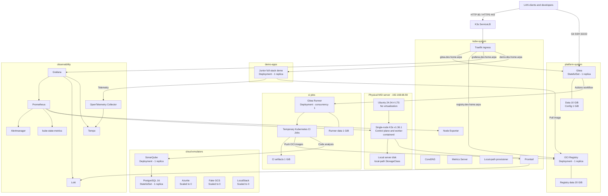

# Current Kubernetes architecture

Last verified: 2026-07-30 (UTC)

## Overview

The development platform runs as a single-node K3s cluster directly on a
physical Ubuntu server. There is no Hyper-V or other virtual-machine layer.

| Component | Current configuration |
|---|---|
| Hardware | Micro-Star International `MS-7C89` physical desktop |
| Operating system | Ubuntu 24.04.4 LTS, Linux 6.8.0-136-generic |
| Virtualization | None detected |
| Kubernetes node | `k3s-server`, control plane and worker |
| Node address | `192.168.68.59` |
| Kubernetes distribution | K3s `v1.36.1+k3s1` |
| Container runtime | containerd `2.2.3-k3s1` |
| Ingress | Bundled Traefik with K3s ServiceLB on ports 80 and 443 |
| Storage | K3s `local-path` volumes on the server disk |
| Desired state | `k8s/overlays/current` Kustomize overlay |
| Availability model | One node; no high availability or storage replication |

## Architecture diagram



## Namespace and workload inventory

| Namespace | Purpose | Current workloads |
|---|---|---|
| `kube-system` | K3s infrastructure | CoreDNS, Traefik, ServiceLB, metrics-server, local-path provisioner, Node Exporter and Promtail |
| `platform-system` | Core development platform | Gitea StatefulSet and OCI Registry Deployment, both with one replica |
| `ci-jobs` | Pipeline execution | One Gitea runner plus short-lived Kubernetes Jobs |
| `observability` | Metrics, logs, traces and dashboards | Grafana, Prometheus, Alertmanager, Loki, Tempo, OpenTelemetry Collector and kube-state-metrics |
| `cloud-emulators` | Code analysis and cloud emulation | SonarQube and PostgreSQL running; Azurite, Fake GCS and LocalStack scaled to zero |
| `demo-apps` | Sample applications | Junior full-stack demo, one replica |
| `default` | Kubernetes default | No application workloads |

## Network entry points

| Address | Destination | Exposure |
|---|---|---|
| `https://gitea.dev.home.arpa` | Gitea | TLS through Traefik |
| `https://registry.dev.home.arpa` | OCI Registry | TLS through Traefik |
| `https://grafana.dev.home.arpa` | Grafana | TLS through Traefik |
| `http://demo.dev.home.arpa` | Junior full-stack demo | HTTP through Traefik |
| `192.168.68.59:32222` | Gitea SSH | NodePort |

Prometheus, Alertmanager, Loki, Tempo, OpenTelemetry and SonarQube use
ClusterIP services. Operators normally reach them using loopback-only
`kubectl port-forward` sessions through `kube-manage`.

## Persistent storage

The default `local-path` StorageClass has a `Delete` reclaim policy,
`WaitForFirstConsumer` volume binding and no volume expansion. The data is
stored on the physical server and is not replicated.

| Namespace | Claim | Capacity | State |
|---|---|---:|---|
| `platform-system` | Gitea data | 10 GiB | Bound |
| `platform-system` | Gitea configuration | 1 GiB | Bound |
| `platform-system` | Registry data | 20 GiB | Bound |
| `ci-jobs` | Runner data | 1 GiB | Bound |
| `ci-jobs` | CI artifacts | 1 GiB | Bound |
| `observability` | Prometheus data | 10 GiB | Bound |
| `observability` | Loki data | 10 GiB | Bound |
| `observability` | Tempo data | 5 GiB | Bound |
| `observability` | Grafana data | 1 GiB | Bound |
| `observability` | Alertmanager data | 1 GiB | Bound |
| `cloud-emulators` | SonarQube data, extensions and logs | 5 GiB total | Bound |
| `cloud-emulators` | SonarQube PostgreSQL data | 5 GiB | Bound |
| `cloud-emulators` | Azurite, Fake GCS and LocalStack data | Deferred | Pending while workloads are scaled to zero |

The live bound capacity at verification time was 69 GiB.

## Security and resource boundaries

- K3s secrets encryption is enabled at rest.
- The host reserves CPU, memory and ephemeral storage for Linux and Kubernetes.
- Kubelet hard and soft eviction thresholds protect the single node from memory
  and disk exhaustion.
- Default-deny NetworkPolicies protect the primary platform namespaces, with
  explicit rules for DNS and approved application flows.
- `ci-jobs` and `demo-apps` enforce the restricted Pod Security Standard.
- Platform, observability and emulator namespaces enforce baseline security and
  audit or warn against restricted-policy violations.
- ResourceQuotas and LimitRanges bound pods, Jobs, PVCs, CPU and memory.
- The Gitea runner can create and inspect namespaced Jobs and read their logs,
  but it is not a cluster administrator and does not receive a Docker socket.
- Secret values are deliberately excluded from Kustomize and Git.

## Operational notes

- The cluster is intentionally not highly available. Host failure interrupts
  the control plane and every workload.
- Local-path storage has no automatic replication. Backups remain required for
  Gitea, the registry, Grafana and Kubernetes objects.
- Optional emulator workloads are normally kept at zero replicas to preserve
  capacity. SonarQube is currently the only active optional service.
- The complete desired state is assembled by
  [`k8s/overlays/current/kustomization.yaml`](../k8s/overlays/current/kustomization.yaml).
- K3s host settings are recorded in
  [`k8s/config/k3s-config.yaml`](../k8s/config/k3s-config.yaml).
- Day-to-day commands and port-forward procedures are documented in
  [`k8s/README.md`](../k8s/README.md).

## Revalidation commands

Run these commands on the standalone server to refresh this document after a
platform change:

```bash
kubectl get nodes -o wide
kubectl get namespaces
kubectl get deployments,statefulsets,daemonsets,jobs -A -o wide
kubectl get pods -A -o wide
kubectl get services,ingresses,networkpolicies -A
kubectl get storageclass,pv
kubectl get pvc -A
kubectl get resourcequota,limitrange -A
kubectl top node
kubectl top pods -A
systemd-detect-virt
```
