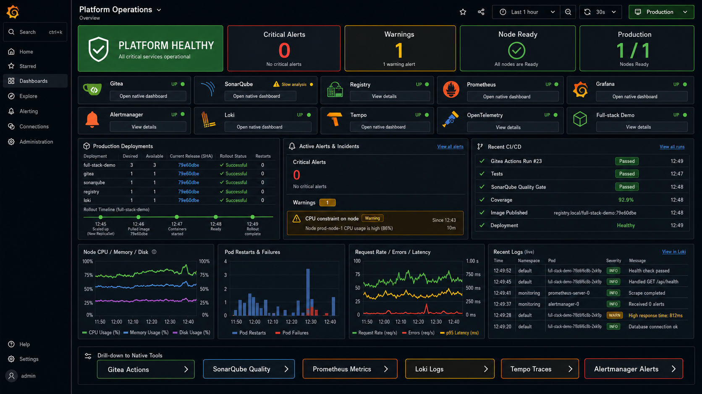

# Platform Operations dashboard

Grafana opens the provisioned **Platform Operations** dashboard as its home page. It gives an incident-first view of the standalone Kubernetes server and links to each native monitoring tool for deeper investigation.



## What the dashboard shows

- overall monitored-target health, critical alerts, warnings, node readiness, and production availability;
- Gitea, registry, Prometheus, Alertmanager, Loki, OpenTelemetry, and Kubernetes workload status;
- node CPU, memory, and maximum filesystem use;
- pod restarts, blocked containers, application request rate, and current release metadata;
- firing alerts and recent warning/error pod logs;
- links to Gitea, SonarQube, Prometheus, Alertmanager, Loki, and Tempo.

The dashboard is source-controlled at `k8s/base/observability/grafana/platform-operations.json`. Grafana provisions it read-only with the stable UID `platform-ops-overview` and reloads file changes every 30 seconds.

## Open the dashboard remotely

On the server, run:

```bash
kube-manage
```

Choose **Grafana monitoring**, then accept the SSH exposure prompt when connecting from another machine. Open `http://localhost:3001`; the Platform Operations dashboard is the default home page.

Native-tool links use their established local ports. Select the corresponding site in `kube-manage` to create its SSH tunnel before opening the link:

| Tool | Local URL |
| --- | --- |
| Gitea | http://localhost:3000 |
| SonarQube | http://localhost:9000 |
| Prometheus | http://localhost:9090 |
| Alertmanager | http://localhost:9093 |
| Loki | http://localhost:3100 |
| Tempo | http://localhost:3200 |

## Data and alerts

Prometheus scrapes kube-state-metrics for workload state and the kubelet cAdvisor endpoint for container resources. Promtail extracts `namespace`, `pod`, and `container` labels from Kubernetes log paths before sending records to Loki.

Recording rules precompute node CPU, memory, disk, and production-availability ratios. Alerts cover service loss, unavailable production replicas, repeated container restarts, blocked image/crash states, and sustained high node CPU in addition to the existing memory and storage warnings.

Alertmanager currently keeps notifications inside the local stack. Add a receiver only after choosing the intended email, chat, or incident channel and storing its credentials in a Kubernetes Secret.

## Deploy dashboard-only platform changes

Use the observability base when updating only monitoring resources; this avoids reconciling application release images managed by the Gitea deployment workflow:

```bash
kubectl apply -k k8s/base/observability
kubectl rollout status deployment/grafana -n observability --timeout=180s
kubectl rollout status deployment/prometheus -n observability --timeout=180s
```

Validate the provisioned dashboard in Grafana at `/d/platform-ops-overview/platform-operations` and confirm Prometheus targets at `http://localhost:9090/targets`.
